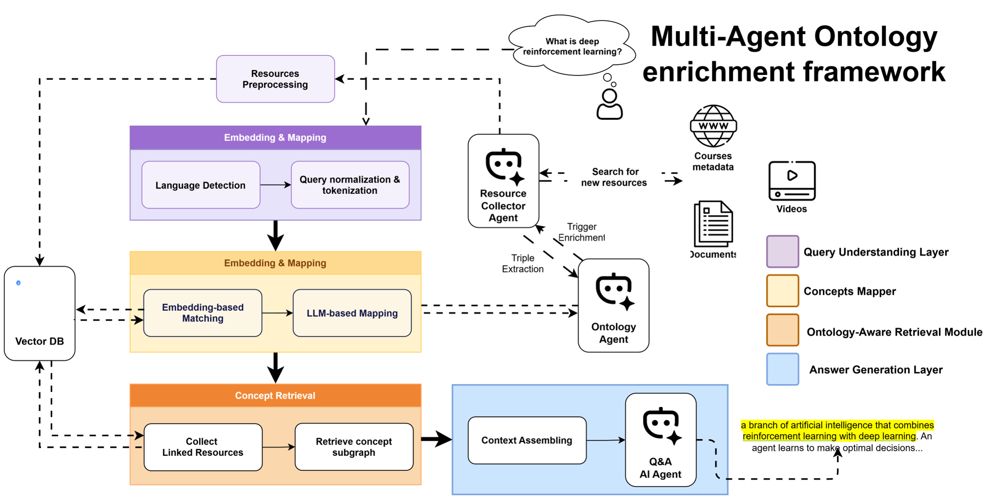

# Multi-Agent LLM Ontology Tutor

A conceptual framework for a self-updating, multilingual, and explainable e-learning tutor. The framework combines ontology enrichment, ontology-aware retrieval-augmented generation (RAG), and cross-lingual ontology alignment to connect dynamic learning resources with structured educational knowledge.

## Overview

E-learning systems often rely on static ontologies that struggle to keep pace with rapidly changing knowledge and digital learning resources. Large language models (LLMs) can improve natural-language interaction, but standalone LLM tutors may produce opaque, inconsistent, or hallucinated answers. Existing educational ontologies are also frequently limited to a single language, reducing accessibility for global learners.

This project proposes a modular, agent-based architecture that addresses these limitations by combining:

- **Automatic ontology enrichment** to discover new concepts and relationships as knowledge gaps appear.
- **Ontology-aware RAG** to ground answers in symbolic relations and retrieved educational evidence.
- **Cross-lingual ontology alignment** to maintain consistent semantics across English, French, and Arabic.

Together, these components support personalized learning while improving adaptability, trustworthiness, inclusivity, and explainability.
